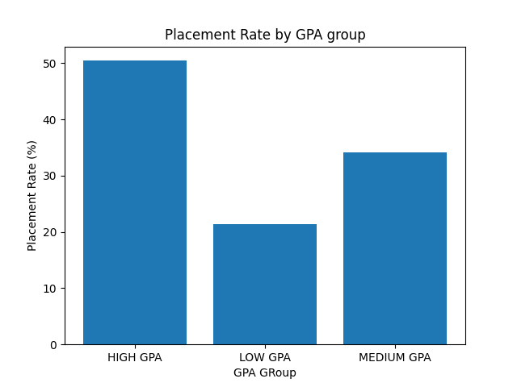
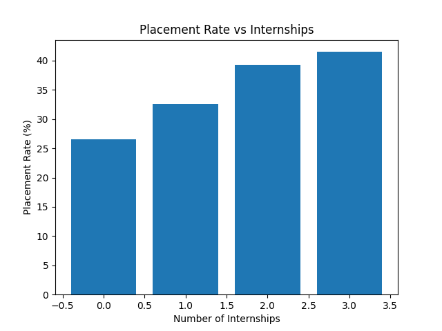
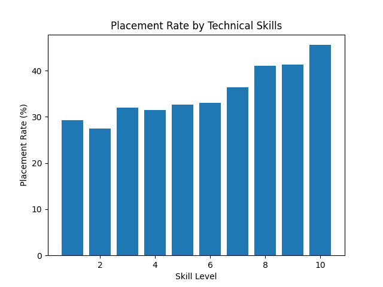

# Student Placement Outcome Analysis

## Problem Statement
Students often lack clarity on which factors influence placement outcomes.
This project analyzes academic, internship, and skill-related factors to
understand their impact on placement success using SQL and Python.

## Tools Used
- Python
- Pandas
- SQLite (SQL)
- Matplotlib
- Jupyter Notebook

## Key Insights
- Higher GPA leads to higher placement probability
- Internship experience significantly improves placement chances
- Technical skills play a critical role in hiring decisions

## Outcome
The analysis provides actionable insights for students to prioritize
academics, internships, and skills for better placement outcomes.

## Visualizations

## Live Demo
[Click here to view the streamlit app](https://placementoutcomeanalysis-clnhdwan9kduwstmtsxksj.streamlit.app/)

